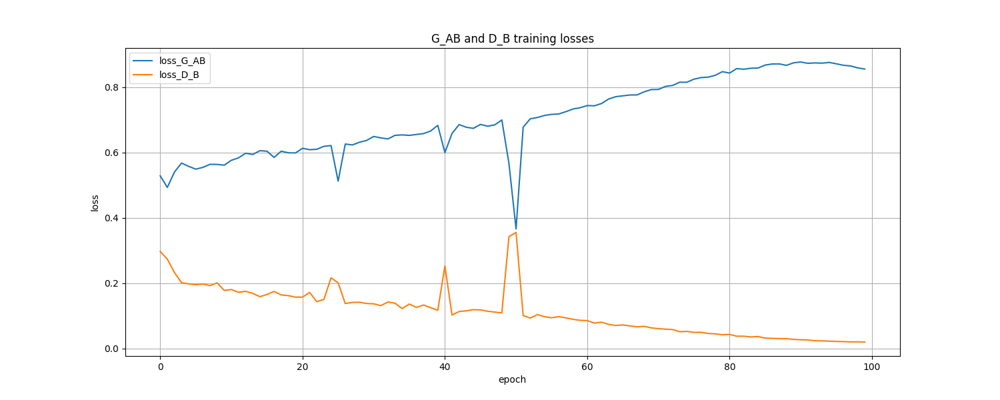
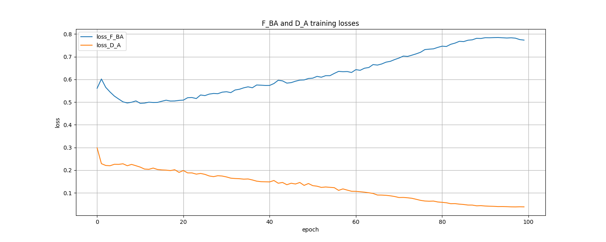
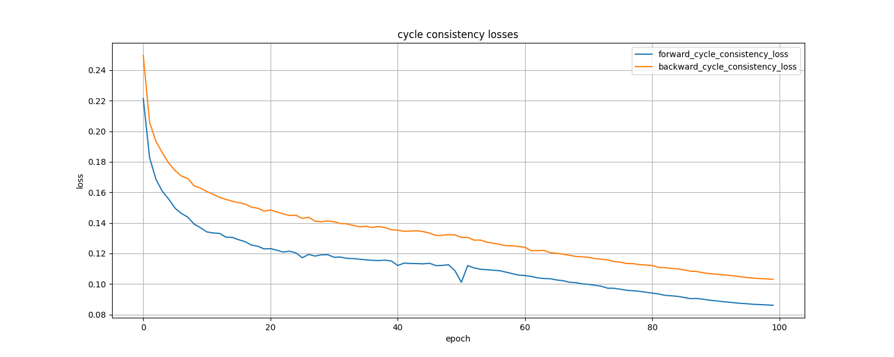
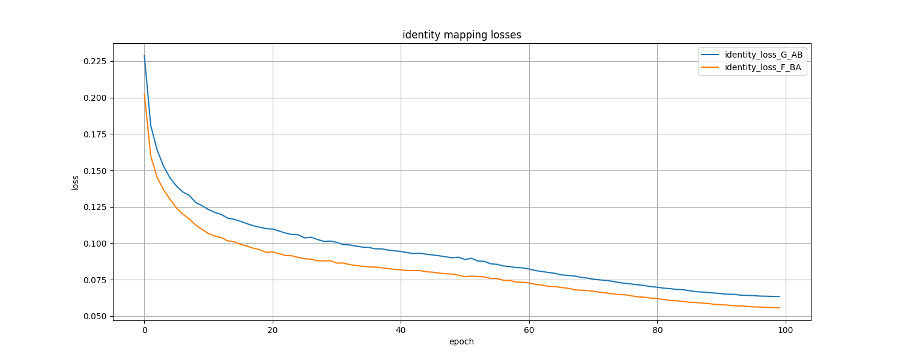
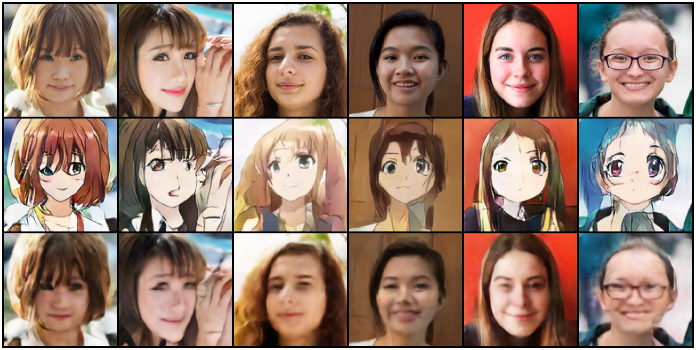
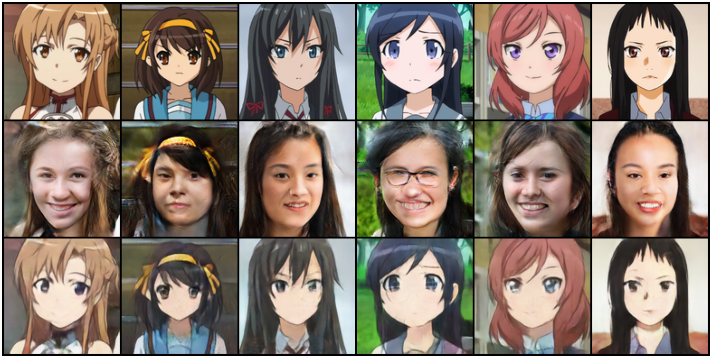

### Dataset:

Датасет сделан на основе [selfie2anime](https://www.kaggle.com/datasets/arnaud58/selfie2anime). Чтобы два домена изображений были более схожими, часть с изображениями женщин заменена на изображения женщин в возрасте от 15 до 20 лет из [Flickr-Faces-HQ](https://github.com/NVlabs/ffhq-dataset).  
Изображения аниме-персонажей оставлены без изменений. Разрешение у всех изображений 128x128 пикселей.  
Информация о возраст и поле для Flickr-Faces-HQ взята из [ffhq-features-dataset](https://github.com/DCGM/ffhq-features-dataset) и [FFHQ-Aging-Dataset](https://github.com/royorel/FFHQ-Aging-Dataset) соотвественно.

### Training Plots

### Results

